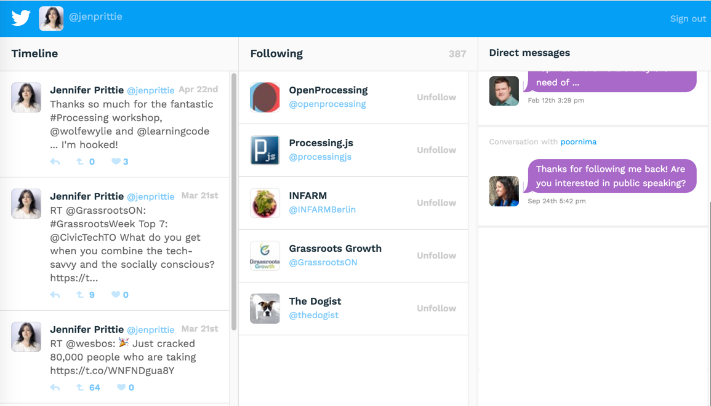

## Twitter interface with Node, Express and Jade
*Project 7 of Treehouse Full Stack JavaScript course*

### Project objectives:
Use Node and Twitter’s REST API to access your Twitter profile information, then render the data to a user via Jade templates and an Express route. Overall, the project offers some key takeaways:
* Server-side communication with APIs offers many more options and greater access to data, but it also requires stricter authentication methods.
* The ability to look at a layout and see the data behind it is an essential skill for full-stack developers. Provided HTML and CSS starter files show what the final project should look like. Replace the example data with your own information, which you grab directly from Twitter's API. Write server-side templates to render HTML to match the mockup.

### Specific requirements:
* Create a Twitter app through Twitter’s developer portal and get the needed API keys.
* Authenticate your application instance from your server code. It’s a good idea to use an npm module for this part.
* Make a template using Jade, Handlebars, or another JavaScript template engine for the main page.
* Set up at least one Express route.
* Populate three columns on your page with data from your Twitter profile: your 5 most recent tweets, your 5 most recent friends and your 5 most recent private messages.
* Each rendered result must include all of the information seen in the sample layout:
  * Tweets column: message content, # of retweets, # of likes, date tweeted
  * Friends column: profile image, real name, screen name
  * Direct messages column: Message body, message date, message time
* Include your personal Twitter name and profile image at the top of the screen.

### Demo:
I currently don't have a way to demonstrate this project without putting my Twitter access keys on GitHub, which I would rather not do! In the meantime, here is a handy screenshot of the finished project, so you can get an idea of what it looks like.

